# Схемы для РПЗ — Вариант 11

> **Как получить изображения схем:**
> 1. Зайди на **https://mermaid.live**
> 2. Вставь код нужной схемы в левое поле
> 3. Справа появится готовая схема — нажми **PNG** или **SVG** → скачай → вставь в Word
>
> Каждая схема оформляется на отдельном листе формата А4 с угловым штампом МГТУ.

---

## ЛИСТ 1. СТРУКТУРНЫЕ СХЕМЫ ВЗАИМОДЕЙСТВИЯ ОБЪЕКТОВ

### 1а. Успешное установление логического соединения

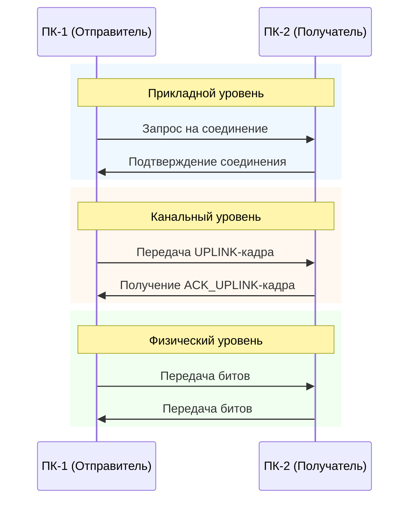
```mermaid
sequenceDiagram
    participant A as ПК-1 (Отправитель)
    participant B as ПК-2 (Получатель)

    rect rgb(240,248,255)
        Note over A,B: Прикладной уровень
        A->>B: Запрос на соединение
        B->>A: Подтверждение соединения
    end
    rect rgb(255,248,240)
        Note over A,B: Канальный уровень
        A->>B: Передача UPLINK-кадра
        B->>A: Получение ACK_UPLINK-кадра
    end
    rect rgb(240,255,240)
        Note over A,B: Физический уровень
        A->>B: Передача битов
        B->>A: Передача битов
    end
```

### 1б. Невозможность установления логического соединения (таймаут)

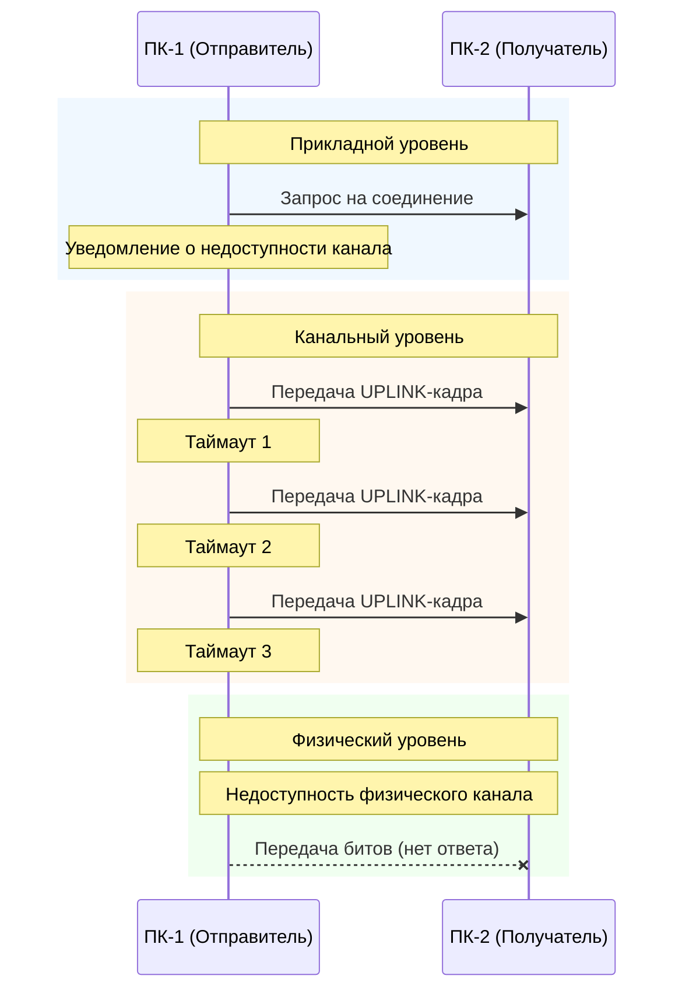
```mermaid
sequenceDiagram
    participant A as ПК-1 (Отправитель)
    participant B as ПК-2 (Получатель)

    rect rgb(240,248,255)
        Note over A,B: Прикладной уровень
        A->>B: Запрос на соединение
        Note over A: Уведомление о недоступности канала
    end
    rect rgb(255,248,240)
        Note over A,B: Канальный уровень
        A->>B: Передача UPLINK-кадра
        Note over A: Таймаут 1
        A->>B: Передача UPLINK-кадра
        Note over A: Таймаут 2
        A->>B: Передача UPLINK-кадра
        Note over A: Таймаут 3
    end
    rect rgb(240,255,240)
        Note over A,B: Физический уровень
        Note over A,B: Недоступность физического канала
        A--xB: Передача битов (нет ответа)
    end
```

### 1в. Успешная передача файла (блока данных)

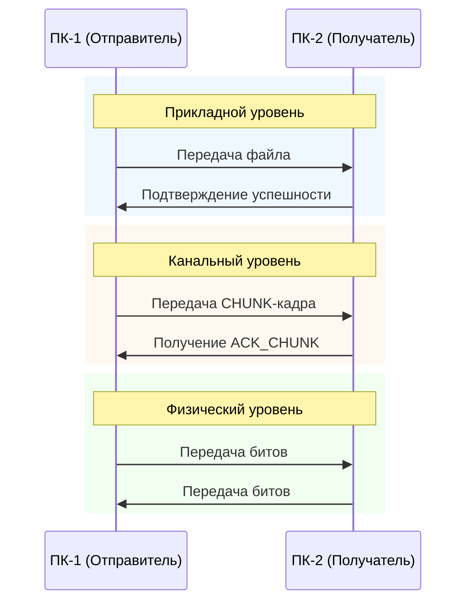
```mermaid
sequenceDiagram
    participant A as ПК-1 (Отправитель)
    participant B as ПК-2 (Получатель)

    rect rgb(240,248,255)
        Note over A,B: Прикладной уровень
        A->>B: Передача файла
        B->>A: Подтверждение успешности
    end
    rect rgb(255,248,240)
        Note over A,B: Канальный уровень
        A->>B: Передача CHUNK-кадра
        B->>A: Получение ACK_CHUNK
    end
    rect rgb(240,255,240)
        Note over A,B: Физический уровень
        A->>B: Передача битов
        B->>A: Передача битов
    end
```

### 1г. Передача файла с ошибкой / потеря блока

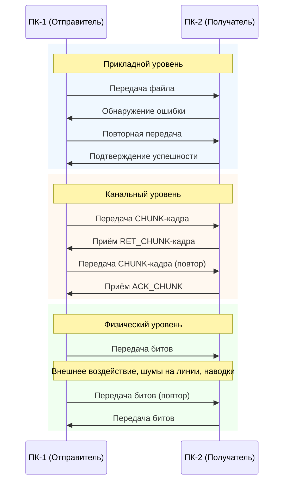
```mermaid
sequenceDiagram
    participant A as ПК-1 (Отправитель)
    participant B as ПК-2 (Получатель)

    rect rgb(240,248,255)
        Note over A,B: Прикладной уровень
        A->>B: Передача файла
        B->>A: Обнаружение ошибки
        A->>B: Повторная передача
        B->>A: Подтверждение успешности
    end
    rect rgb(255,248,240)
        Note over A,B: Канальный уровень
        A->>B: Передача CHUNK-кадра
        B->>A: Приём RET_CHUNK-кадра
        A->>B: Передача CHUNK-кадра (повтор)
        B->>A: Приём ACK_CHUNK
    end
    rect rgb(240,255,240)
        Note over A,B: Физический уровень
        A->>B: Передача битов
        Note over A,B: Внешнее воздействие, шумы на линии, наводки
        A->>B: Передача битов (повтор)
        B->>A: Передача битов
    end
```

### 1д. Успешное разъединение логического соединения

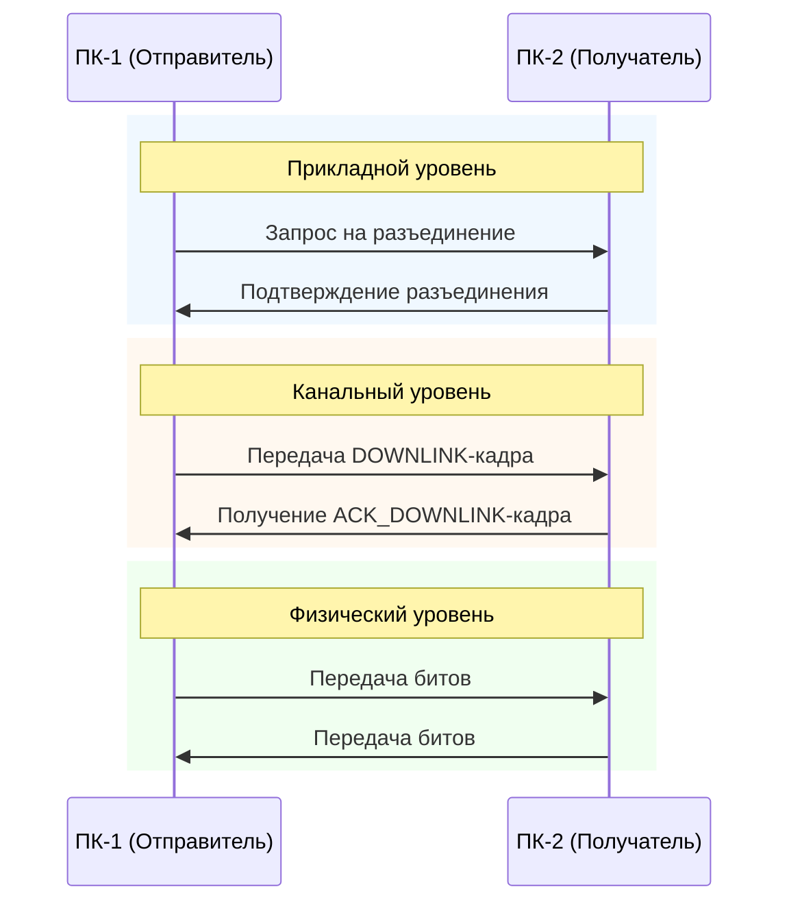
```mermaid
sequenceDiagram
    participant A as ПК-1 (Отправитель)
    participant B as ПК-2 (Получатель)

    rect rgb(240,248,255)
        Note over A,B: Прикладной уровень
        A->>B: Запрос на разъединение
        B->>A: Подтверждение разъединения
    end
    rect rgb(255,248,240)
        Note over A,B: Канальный уровень
        A->>B: Передача DOWNLINK-кадра
        B->>A: Получение ACK_DOWNLINK-кадра
    end
    rect rgb(240,255,240)
        Note over A,B: Физический уровень
        A->>B: Передача битов
        B->>A: Передача битов
    end
```

### 1е. Невозможность разъединения (таймаут)

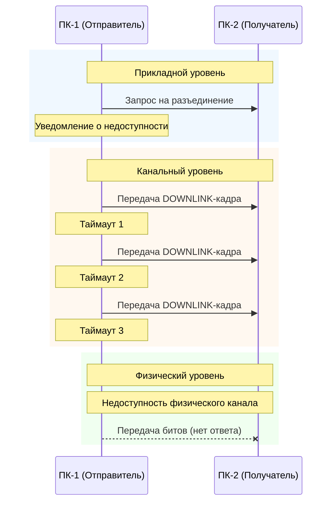
```mermaid
sequenceDiagram
    participant A as ПК-1 (Отправитель)
    participant B as ПК-2 (Получатель)

    rect rgb(240,248,255)
        Note over A,B: Прикладной уровень
        A->>B: Запрос на разъединение
        Note over A: Уведомление о недоступности
    end
    rect rgb(255,248,240)
        Note over A,B: Канальный уровень
        A->>B: Передача DOWNLINK-кадра
        Note over A: Таймаут 1
        A->>B: Передача DOWNLINK-кадра
        Note over A: Таймаут 2
        A->>B: Передача DOWNLINK-кадра
        Note over A: Таймаут 3
    end
    rect rgb(240,255,240)
        Note over A,B: Физический уровень
        Note over A,B: Недоступность физического канала
        A--xB: Передача битов (нет ответа)
    end
```

---

## ЛИСТ 2. ВРЕМЕННЫЕ ДИАГРАММЫ

### 2а. Успешное установление соединения

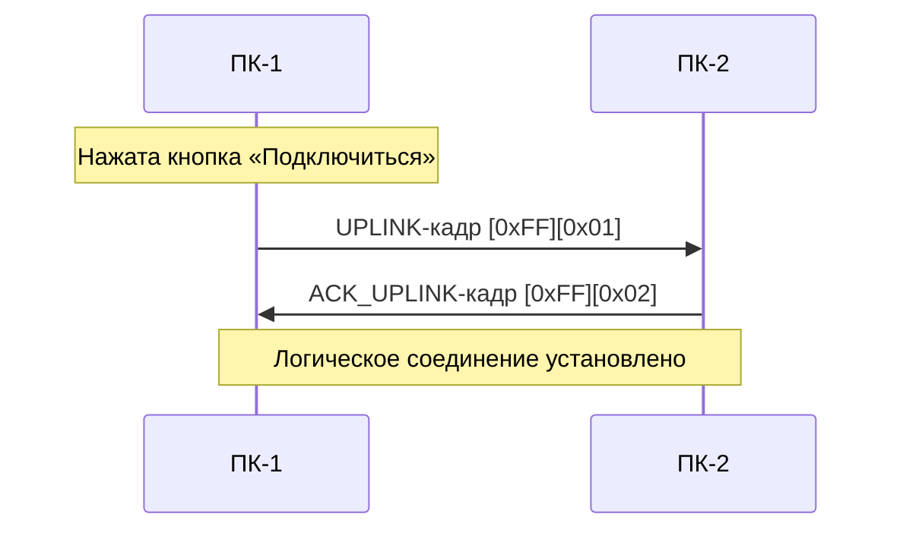
```mermaid
sequenceDiagram
    participant A as ПК-1
    participant B as ПК-2

    Note over A: Нажата кнопка «Подключиться»
    A->>B: UPLINK-кадр [0xFF][0x01]
    B->>A: ACK_UPLINK-кадр [0xFF][0x02]
    Note over A,B: Логическое соединение установлено
```

### 2б. Неуспешное установление соединения (3 таймаута)

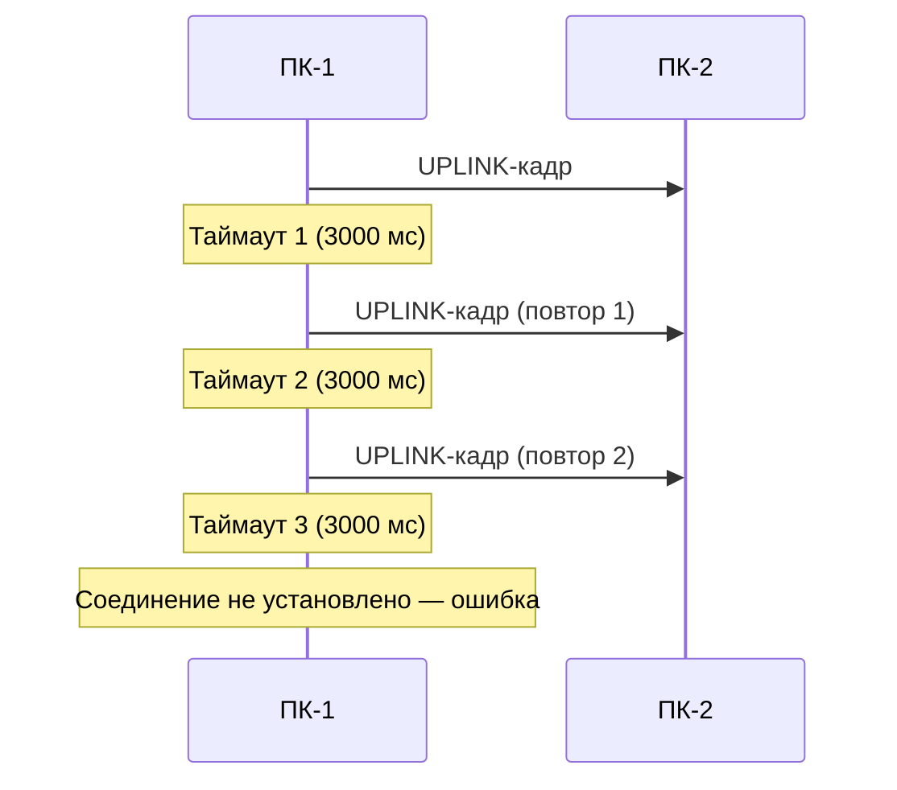
```mermaid
sequenceDiagram
    participant A as ПК-1
    participant B as ПК-2

    A->>B: UPLINK-кадр
    Note over A: Таймаут 1 (3000 мс)
    A->>B: UPLINK-кадр (повтор 1)
    Note over A: Таймаут 2 (3000 мс)
    A->>B: UPLINK-кадр (повтор 2)
    Note over A: Таймаут 3 (3000 мс)
    Note over A: Соединение не установлено — ошибка
```

### 2в. Успешная передача файла

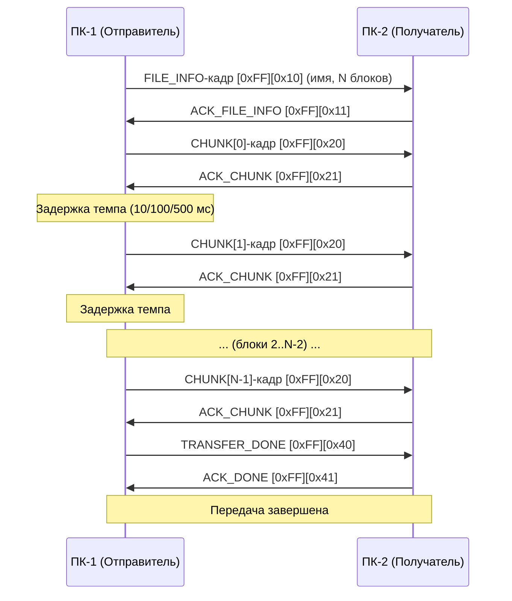
```mermaid
sequenceDiagram
    participant A as ПК-1 (Отправитель)
    participant B as ПК-2 (Получатель)

    A->>B: FILE_INFO-кадр [0xFF][0x10] (имя, N блоков)
    B->>A: ACK_FILE_INFO [0xFF][0x11]

    A->>B: CHUNK[0]-кадр [0xFF][0x20]
    B->>A: ACK_CHUNK [0xFF][0x21]
    Note over A: Задержка темпа (10/100/500 мс)

    A->>B: CHUNK[1]-кадр [0xFF][0x20]
    B->>A: ACK_CHUNK [0xFF][0x21]
    Note over A: Задержка темпа

    Note over A,B: ... (блоки 2..N-2) ...

    A->>B: CHUNK[N-1]-кадр [0xFF][0x20]
    B->>A: ACK_CHUNK [0xFF][0x21]

    A->>B: TRANSFER_DONE [0xFF][0x40]
    B->>A: ACK_DONE [0xFF][0x41]
    Note over A,B: Передача завершена
```

### 2г. Передача с ошибкой и повторной отправкой

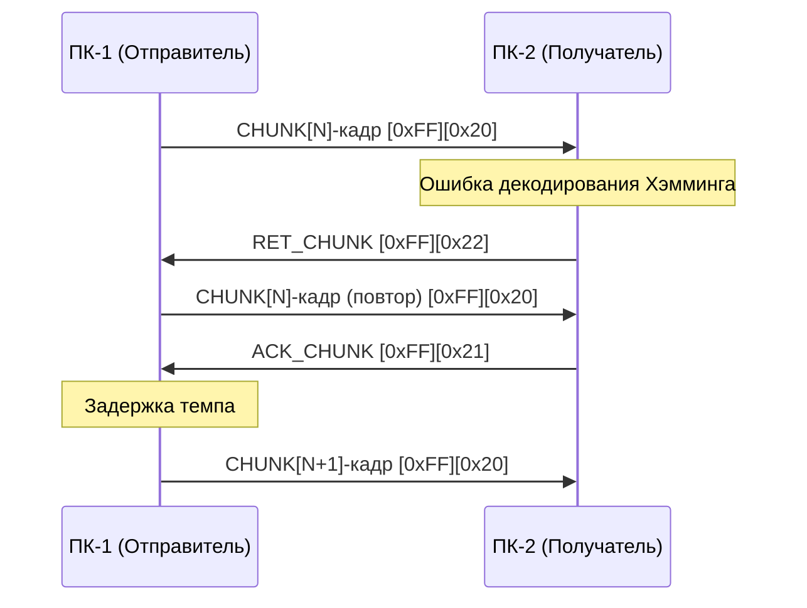
```mermaid
sequenceDiagram
    participant A as ПК-1 (Отправитель)
    participant B as ПК-2 (Получатель)

    A->>B: CHUNK[N]-кадр [0xFF][0x20]
    Note over B: Ошибка декодирования Хэмминга
    B->>A: RET_CHUNK [0xFF][0x22]
    A->>B: CHUNK[N]-кадр (повтор) [0xFF][0x20]
    B->>A: ACK_CHUNK [0xFF][0x21]
    Note over A: Задержка темпа
    A->>B: CHUNK[N+1]-кадр [0xFF][0x20]
```

### 2д. Управление темпом передачи

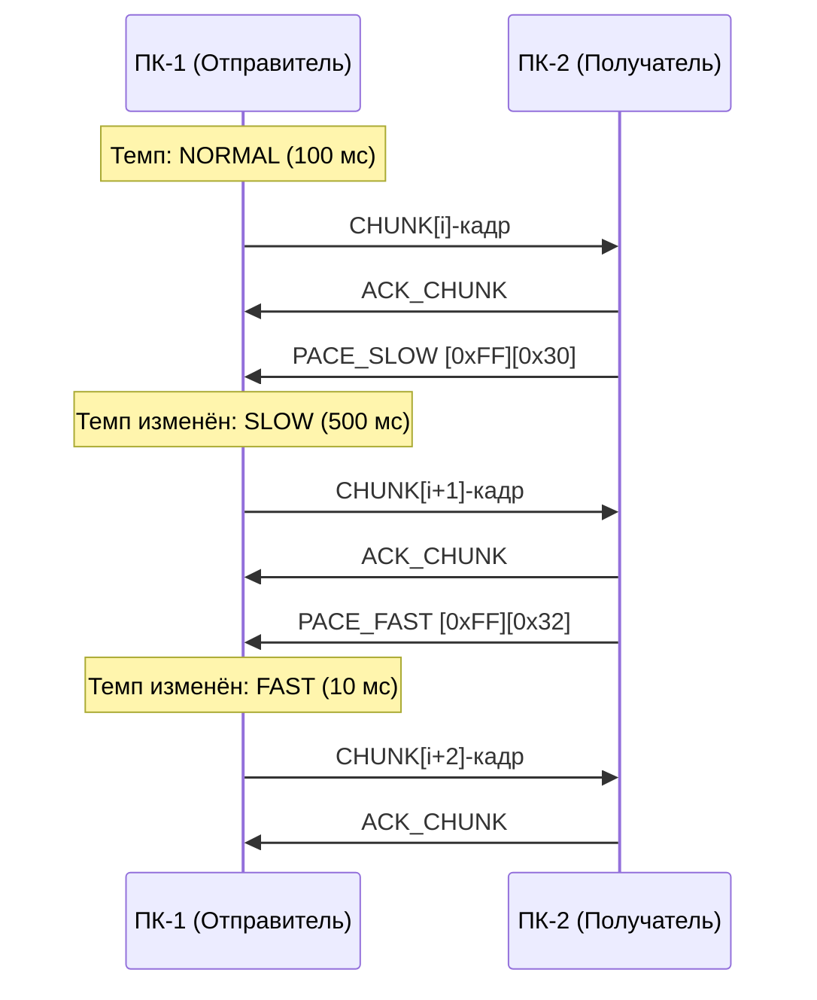
```mermaid
sequenceDiagram
    participant A as ПК-1 (Отправитель)
    participant B as ПК-2 (Получатель)

    Note over A: Темп: NORMAL (100 мс)
    A->>B: CHUNK[i]-кадр
    B->>A: ACK_CHUNK
    B->>A: PACE_SLOW [0xFF][0x30]
    Note over A: Темп изменён: SLOW (500 мс)
    A->>B: CHUNK[i+1]-кадр
    B->>A: ACK_CHUNK
    B->>A: PACE_FAST [0xFF][0x32]
    Note over A: Темп изменён: FAST (10 мс)
    A->>B: CHUNK[i+2]-кадр
    B->>A: ACK_CHUNK
```

### 2е. Успешное разъединение

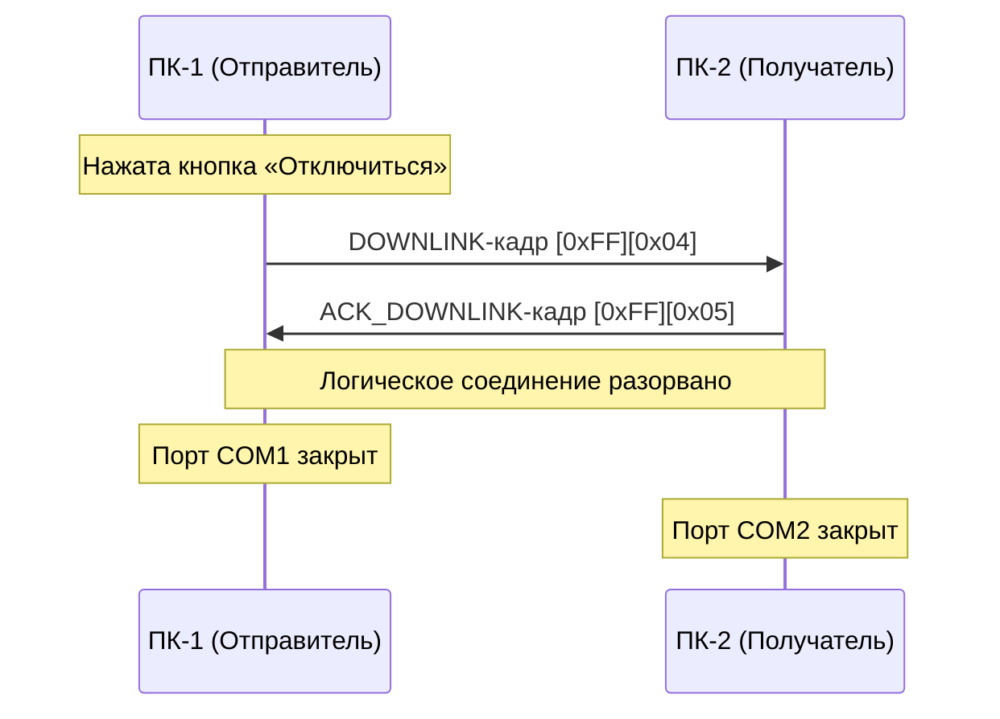
```mermaid
sequenceDiagram
    participant A as ПК-1 (Отправитель)
    participant B as ПК-2 (Получатель)

    Note over A: Нажата кнопка «Отключиться»
    A->>B: DOWNLINK-кадр [0xFF][0x04]
    B->>A: ACK_DOWNLINK-кадр [0xFF][0x05]
    Note over A,B: Логическое соединение разорвано
    Note over A: Порт COM1 закрыт
    Note over B: Порт COM2 закрыт
```

---

## ЛИСТ 3. СТРУКТУРА ПРОТОКОЛЬНЫХ БЛОКОВ ДАННЫХ

### Блок данных физического уровня

```
Строка-сообщение (текстовый файл)
┌─────────────────────────────────────────────────────────────────┐
│  Текстовые данные (байты файла в кодировке UTF-8 / Win-1251)    │
└─────────────────────────────────────────────────────────────────┘
```

### Служебные кадры канального уровня

```
UPLINK-кадр                          ACK_UPLINK-кадр
(запрос установления соединения)     (положительная квитанция на UPLINK)
┌──────────┬──────────┐              ┌──────────┬──────────┐
│11111111  │00000001  │              │11111111  │00000010  │
│  1 байт  │  1 байт  │              │  1 байт  │  1 байт  │
└──────────┴──────────┘              └──────────┴──────────┘
Старт-байт  Тип кадра                Старт-байт  Тип кадра


DOWNLINK-кадр                        ACK_DOWNLINK-кадр
(разрыв логического соединения)      (положительная квитанция на DOWNLINK)
┌──────────┬──────────┐              ┌──────────┬──────────┐
│11111111  │00000100  │              │11111111  │00000101  │
│  1 байт  │  1 байт  │              │  1 байт  │  1 байт  │
└──────────┴──────────┘              └──────────┴──────────┘
Старт-байт  Тип кадра                Старт-байт  Тип кадра


ACK_CHUNK-кадр                       RET_CHUNK-кадр
(положительная квитанция на CHUNK)   (запрос повторной передачи блока)
┌──────────┬──────────┐              ┌──────────┬──────────┐
│11111111  │00100001  │              │11111111  │00100010  │
│  1 байт  │  1 байт  │              │  1 байт  │  1 байт  │
└──────────┴──────────┘              └──────────┴──────────┘
Старт-байт  Тип кадра                Старт-байт  Тип кадра


PACE_SLOW-кадр                       PACE_NORMAL-кадр
(установить темп: 500 мс)            (установить темп: 100 мс)
┌──────────┬──────────┐              ┌──────────┬──────────┐
│11111111  │00110000  │              │11111111  │00110001  │
│  1 байт  │  1 байт  │              │  1 байт  │  1 байт  │
└──────────┴──────────┘              └──────────┴──────────┘
Старт-байт  Тип кадра                Старт-байт  Тип кадра


PACE_FAST-кадр                       TRANSFER_DONE-кадр
(установить темп: 10 мс)             (передача завершена)
┌──────────┬──────────┐              ┌──────────┬──────────┐
│11111111  │00110010  │              │11111111  │01000000  │
│  1 байт  │  1 байт  │              │  1 байт  │  1 байт  │
└──────────┴──────────┘              └──────────┴──────────┘
Старт-байт  Тип кадра                Старт-байт  Тип кадра


ACK_DONE-кадр
(положительная квитанция на TRANSFER_DONE)
┌──────────┬──────────┐
│11111111  │01000001  │
│  1 байт  │  1 байт  │
└──────────┴──────────┘
Старт-байт  Тип кадра
```

### Информационный кадр канального уровня (FILE_INFO-кадр)

```
┌──────────┬──────────┬──────────────────┬──────────────────────┬──────────────────┐
│11111111  │00010000  │  name_len         │  Имя файла           │  total_chunks    │
│  1 байт  │  1 байт  │  2 байта (LE)    │  name_len байт       │  4 байта (LE)    │
└──────────┴──────────┴──────────────────┴──────────────────────┴──────────────────┘
Старт-байт  Тип кадра  Длина имени файла  Имя файла (UTF-8)      Кол-во блоков
```

### Информационный кадр канального уровня (CHUNK-кадр)

```
┌──────────┬──────────┬──────────────────┬──────────────────┬──────────────────────────┐
│11111111  │00100000  │  chunk_index      │  data_len        │  Данные (Хэмминг)        │
│  1 байт  │  1 байт  │  4 байта (LE)    │  2 байта (LE)    │  до 256 байт             │
└──────────┴──────────┴──────────────────┴──────────────────┴──────────────────────────┘
Старт-байт  Тип кадра  Номер блока        Длина данных       Закодированные данные [7,4]
```

### Блок данных прикладного уровня

```
┌─────────────────────────────────────────────────────────────────────────────────────┐
│  Содержимое текстового файла (декодированные блоки, собранные в порядке chunk_index) │
└─────────────────────────────────────────────────────────────────────────────────────┘
```

---

## ЛИСТ 4. СТРУКТУРНАЯ СХЕМА ПРОГРАММЫ

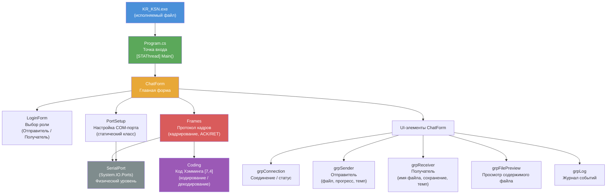
```mermaid
graph TD
    A["KR_KSN.exe\n(исполняемый файл)"] --> B["Program.cs\nТочка входа\n[STAThread] Main()"]
    B --> C["ChatForm\nГлавная форма"]
    C --> D["LoginForm\nВыбор роли\n(Отправитель / Получатель)"]
    C --> E["PortSetup\nНастройка COM-порта\n(статический класс)"]
    C --> F["Frames\nПротокол кадров\n(кадрирование, ACK/RET)"]
    F --> G["Coding\nКод Хэмминга [7,4]\n(кодирование / декодирование)"]
    F --> H["SerialPort\n(System.IO.Ports)\nФизический уровень"]
    E --> H
    C --> I["UI-элементы ChatForm"]
    I --> I1["grpConnection\nСоединение / статус"]
    I --> I2["grpSender\nОтправитель\n(файл, прогресс, темп)"]
    I --> I3["grpReceiver\nПолучатель\n(имя файла, сохранение, темп)"]
    I --> I4["grpFilePreview\nПросмотр содержимого файла"]
    I --> I5["grpLog\nЖурнал событий"]

    style A fill:#4a90d9,color:#fff
    style B fill:#5ba85a,color:#fff
    style C fill:#e8a838,color:#fff
    style F fill:#d95b5b,color:#fff
    style G fill:#9b59b6,color:#fff
    style H fill:#7f8c8d,color:#fff
```

---

## ЛИСТ 5. ГРАФ ДИАЛОГА ПОЛЬЗОВАТЕЛЯ

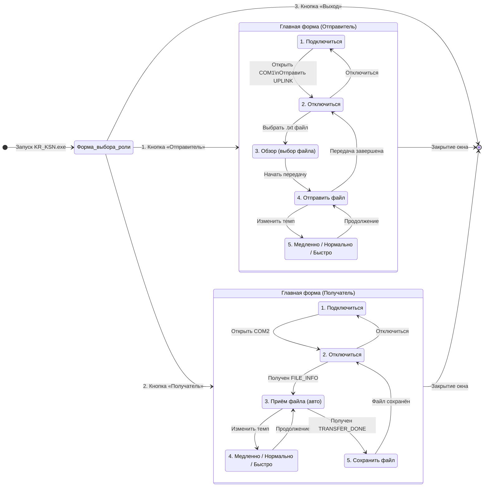
```mermaid
stateDiagram-v2
    direction LR

    [*] --> Форма_выбора_роли : Запуск KR_KSN.exe

    Форма_выбора_роли --> Главная_форма_Отправитель : 1. Кнопка «Отправитель»
    Форма_выбора_роли --> Главная_форма_Получатель : 2. Кнопка «Получатель»
    Форма_выбора_роли --> [*] : 3. Кнопка «Выход»

    state "Главная форма (Отправитель)" as Главная_форма_Отправитель {
        direction TB
        Ожидание_подключения_S : 1. Подключиться
        Подключён_S : 2. Отключиться
        Файл_выбран : 3. Обзор (выбор файла)
        Передача : 4. Отправить файл
        Темп_S : 5. Медленно / Нормально / Быстро

        Ожидание_подключения_S --> Подключён_S : Открыть COM1\nОтправить UPLINK
        Подключён_S --> Файл_выбран : Выбрать .txt файл
        Файл_выбран --> Передача : Начать передачу
        Передача --> Темп_S : Изменить темп
        Темп_S --> Передача : Продолжение
        Передача --> Подключён_S : Передача завершена
        Подключён_S --> Ожидание_подключения_S : Отключиться
    }

    state "Главная форма (Получатель)" as Главная_форма_Получатель {
        direction TB
        Ожидание_подключения_R : 1. Подключиться
        Подключён_R : 2. Отключиться
        Приём : 3. Приём файла (авто)
        Темп_R : 4. Медленно / Нормально / Быстро
        Сохранение : 5. Сохранить файл

        Ожидание_подключения_R --> Подключён_R : Открыть COM2
        Подключён_R --> Приём : Получен FILE_INFO
        Приём --> Темп_R : Изменить темп
        Темп_R --> Приём : Продолжение
        Приём --> Сохранение : Получен TRANSFER_DONE
        Сохранение --> Подключён_R : Файл сохранён
        Подключён_R --> Ожидание_подключения_R : Отключиться
    }

    Главная_форма_Отправитель --> [*] : Закрытие окна
    Главная_форма_Получатель --> [*] : Закрытие окна
```

---

## ЛИСТ 6. АЛГОРИТМЫ ПРОГРАММЫ

### 6а. Открытие COM-порта

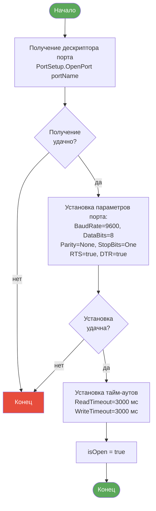
```mermaid
flowchart TD
    A([Начало]) --> B[Получение дескриптора порта\nPortSetup.OpenPort portName]
    B --> C{Получение\nудачно?}
    C -- нет --> D[Конец]
    C -- да --> E[Установка параметров порта:\nBaudRate=9600, DataBits=8\nParity=None, StopBits=One\nRTS=true, DTR=true]
    E --> F{Установка\nудачна?}
    F -- нет --> D
    F -- да --> G[Установка тайм-аутов\nReadTimeout=3000 мс\nWriteTimeout=3000 мс]
    G --> H[isOpen = true]
    H --> I([Конец])

    style A fill:#5ba85a,color:#fff
    style I fill:#5ba85a,color:#fff
    style D fill:#e74c3c,color:#fff
```

### 6б. Закрытие COM-порта

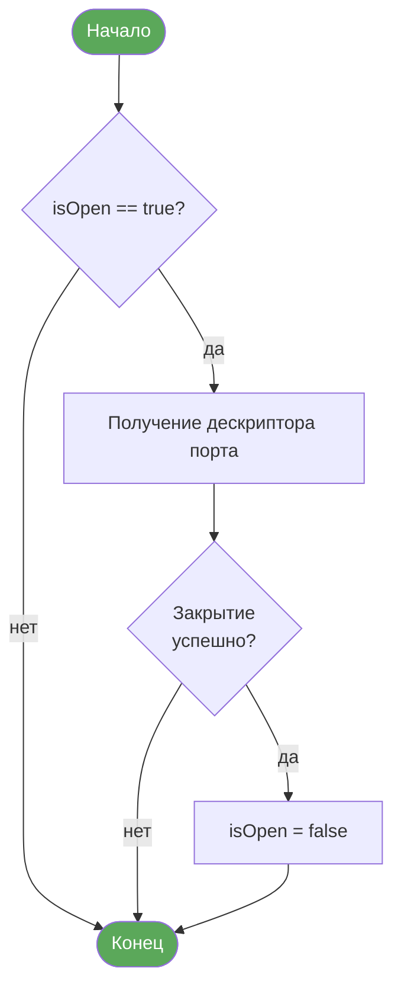
```mermaid
flowchart TD
    A([Начало]) --> B{isOpen == true?}
    B -- нет --> C([Конец])
    B -- да --> D[Получение дескриптора порта]
    D --> E{Закрытие\nуспешно?}
    E -- нет --> C
    E -- да --> F[isOpen = false]
    F --> C

    style A fill:#5ba85a,color:#fff
    style C fill:#5ba85a,color:#fff
```

### 6в. Установка логического соединения (Отправитель)

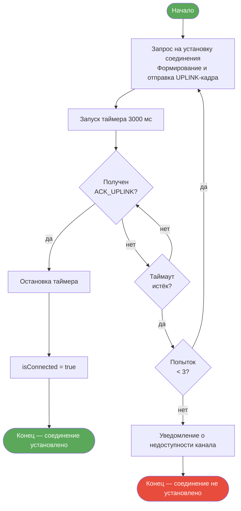
```mermaid
flowchart TD
    A([Начало]) --> B[Запрос на установку соединения\nФормирование и отправка UPLINK-кадра]
    B --> C[Запуск таймера 3000 мс]
    C --> D{Получен\nACK_UPLINK?}
    D -- да --> E[Остановка таймера]
    E --> F[isConnected = true]
    F --> G([Конец — соединение установлено])
    D -- нет --> H{Таймаут\nистёк?}
    H -- нет --> D
    H -- да --> I{Попыток\n< 3?}
    I -- да --> B
    I -- нет --> J[Уведомление о недоступности канала]
    J --> K([Конец — соединение не установлено])

    style A fill:#5ba85a,color:#fff
    style G fill:#5ba85a,color:#fff
    style K fill:#e74c3c,color:#fff
```

### 6г. Отправка кадра (SendChunk)

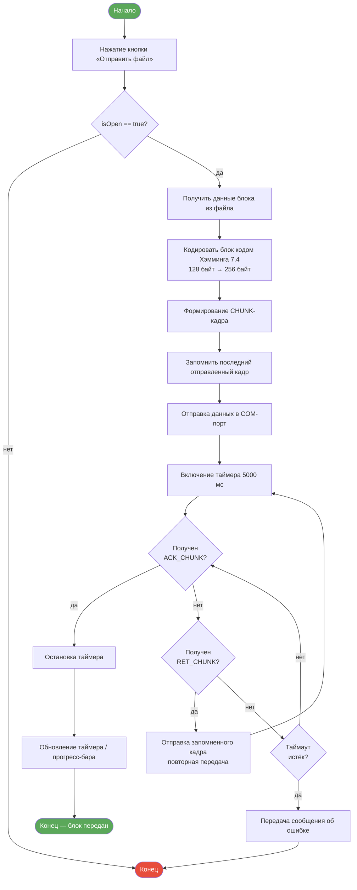
```mermaid
flowchart TD
    A([Начало]) --> B[Нажатие кнопки «Отправить файл»]
    B --> C{isOpen == true?}
    C -- нет --> D([Конец])
    C -- да --> E[Получить данные блока из файла]
    E --> F[Кодировать блок кодом Хэмминга 7,4\n128 байт → 256 байт]
    F --> G[Формирование CHUNK-кадра]
    G --> H[Запомнить последний отправленный кадр]
    H --> I[Отправка данных в COM-порт]
    I --> J[Включение таймера 5000 мс]
    J --> K{Получен\nACK_CHUNK?}
    K -- да --> L[Остановка таймера]
    L --> M[Обновление таймера / прогресс-бара]
    M --> N([Конец — блок передан])
    K -- нет --> O{Получен\nRET_CHUNK?}
    O -- да --> P[Отправка запомненного кадра\nповторная передача]
    P --> J
    O -- нет --> Q{Таймаут\nистёк?}
    Q -- нет --> K
    Q -- да --> R[Передача сообщения об ошибке]
    R --> D

    style A fill:#5ba85a,color:#fff
    style N fill:#5ba85a,color:#fff
    style D fill:#e74c3c,color:#fff
```

### 6д. Получение кадра (FrameAction / DataReceived)

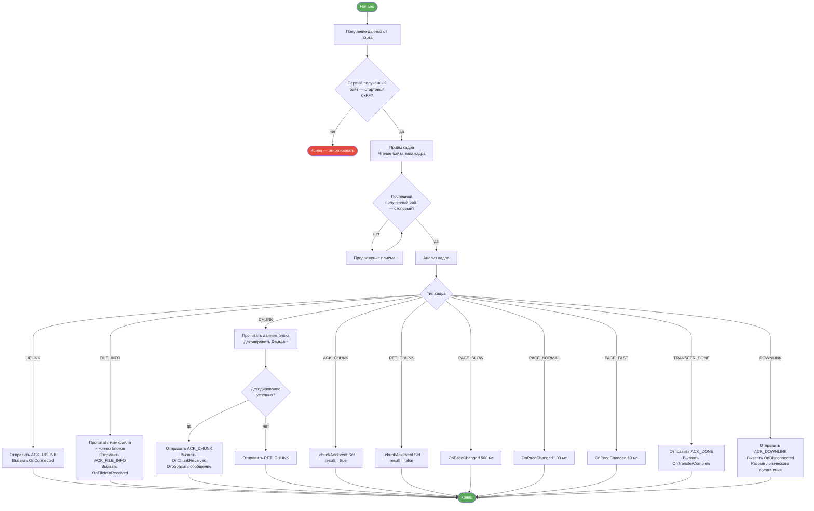
```mermaid
flowchart TD
    A([Начало]) --> B[Получение данных от порта]
    B --> C{Первый полученный\nбайт — стартовый\n0xFF?}
    C -- нет --> D([Конец — игнорировать])
    C -- да --> E[Приём кадра\nЧтение байта типа кадра]
    E --> F{Последний\nполученный байт\n— стоповый?}
    F -- нет --> G[Продолжение приёма]
    G --> F
    F -- да --> H[Анализ кадра]
    H --> I{Тип кадра}
    I -- UPLINK --> J[Отправить ACK_UPLINK\nВызвать OnConnected]
    I -- FILE_INFO --> K[Прочитать имя файла\nи кол-во блоков\nОтправить ACK_FILE_INFO\nВызвать OnFileInfoReceived]
    I -- CHUNK --> L[Прочитать данные блока\nДекодировать Хэмминг]
    L --> M{Декодирование\nуспешно?}
    M -- да --> N[Отправить ACK_CHUNK\nВызвать OnChunkReceived\nОтобразить сообщение]
    M -- нет --> O[Отправить RET_CHUNK]
    I -- ACK_CHUNK --> P[_chunkAckEvent.Set\nresult = true]
    I -- RET_CHUNK --> Q[_chunkAckEvent.Set\nresult = false]
    I -- PACE_SLOW --> R[OnPaceChanged 500 мс]
    I -- PACE_NORMAL --> S[OnPaceChanged 100 мс]
    I -- PACE_FAST --> T[OnPaceChanged 10 мс]
    I -- TRANSFER_DONE --> U[Отправить ACK_DONE\nВызвать OnTransferComplete]
    I -- DOWNLINK --> V[Отправить ACK_DOWNLINK\nВызвать OnDisconnected\nРазрыв логического соединения]
    J --> W([Конец])
    K --> W
    N --> W
    O --> W
    P --> W
    Q --> W
    R --> W
    S --> W
    T --> W
    U --> W
    V --> W

    style A fill:#5ba85a,color:#fff
    style W fill:#5ba85a,color:#fff
    style D fill:#e74c3c,color:#fff
```

### 6е. Алгоритм кодирования нибла — EncodeNibble (Хэмминг [7,4])

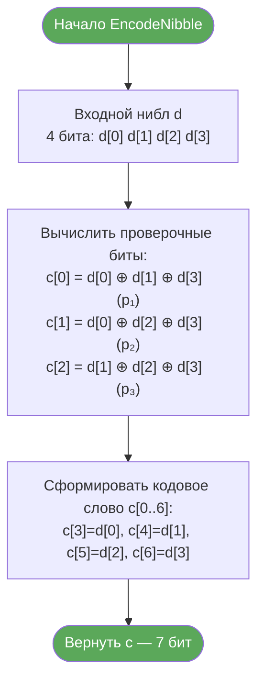
```mermaid
flowchart TD
    A([Начало EncodeNibble]) --> B["Входной нибл d\n4 бита: d[0] d[1] d[2] d[3]"]
    B --> C["Вычислить проверочные биты:\nc[0] = d[0] ⊕ d[1] ⊕ d[3]  (p₁)\nc[1] = d[0] ⊕ d[2] ⊕ d[3]  (p₂)\nc[2] = d[1] ⊕ d[2] ⊕ d[3]  (p₃)"]
    C --> D["Сформировать кодовое слово c[0..6]:\nc[3]=d[0], c[4]=d[1], c[5]=d[2], c[6]=d[3]"]
    D --> E(["Вернуть c — 7 бит"])

    style A fill:#5ba85a,color:#fff
    style E fill:#5ba85a,color:#fff
```

### 6ж. Алгоритм декодирования и исправления ошибок — DecodeNibble

```mermaid
flowchart TD
    A([Начало DecodeNibble]) --> B["Входное кодовое слово c\n7 бит: c[0]..c[6]"]
    B --> C["Вычислить синдром:\ns0 = c[6]⊕c[4]⊕c[2]⊕c[0]\ns1 = c[5]⊕c[4]⊕c[1]⊕c[0]\ns2 = c[3]⊕c[2]⊕c[1]⊕c[0]"]
    C --> D["errPos = s0×4 + s1×2 + s2×1"]
    D --> E{errPos == 0?}
    E -- "да\n(ошибок нет)" --> F["Данные корректны"]
    E -- "нет\n(есть ошибка)" --> G["Инвертировать бит\nc[errPos-1] = !c[errPos-1]"]
    G --> F
    F --> H["Извлечь информационные биты:\nd = c[3] c[4] c[5] c[6]"]
    H --> I(["Вернуть d — 4 бита"])

    style A fill:#5ba85a,color:#fff
    style I fill:#5ba85a,color:#fff
    style E fill:#f39c12,color:#fff
    style G fill:#e74c3c,color:#fff
```

### 6з. Алгоритм передачи файла (SendFileThread)

```mermaid
flowchart TD
    A([Начало SendFileThread]) --> B["Прочитать файл в байты\nfileBytes = File.ReadAllBytes(path)"]
    B --> C["Разбить на блоки по 128 байт\ntotalChunks = ⌈len / 128⌉"]
    C --> D["Отправить FILE_INFO\n(имя файла, totalChunks)"]
    D --> E{Получен\nACK_FILE_INFO?}
    E -- нет --> F(["Ошибка: таймаут\nПрервать передачу"])
    E -- да --> G["i = 0\ntransferOk = true"]
    G --> H{i < totalChunks\nИ transferOk?}
    H -- нет --> M["Отправить TRANSFER_DONE"]
    H -- да --> I["Взять блок i (до 128 байт)"]
    I --> J["Кодировать Хэммингом\n128 байт → 256 байт"]
    J --> K["Отправить CHUNK[i]\nОжидать ACK (5 сек)"]
    K --> L{Ответ?}
    L -- ACK_CHUNK --> N["Обновить прогресс-бар\nЗадержка темпа\ni = i + 1"]
    L -- RET_CHUNK --> K
    L -- "Таймаут" --> O["transferOk = false\nЗаписать ошибку в журнал"]
    N --> H
    O --> H
    M --> P{Получен\nACK_DONE?}
    P -- да --> Q(["Передача завершена"])
    P -- нет --> R(["Ошибка: нет ACK_DONE"])

    style A fill:#5ba85a,color:#fff
    style Q fill:#5ba85a,color:#fff
    style F fill:#e74c3c,color:#fff
    style R fill:#e74c3c,color:#fff
    style L fill:#f39c12,color:#fff
    style E fill:#f39c12,color:#fff
    style P fill:#f39c12,color:#fff
```

---

## Таблица типов кадров (для вставки в РПЗ)

| Тип кадра | Код (hex) | Код (bin) | Направление | Описание |
|---|---|---|---|---|
| UPLINK | 0x01 | 00000001 | S → R | Запрос установления соединения |
| ACK_UPLINK | 0x02 | 00000010 | R → S | Подтверждение соединения |
| RET_UPLINK | 0x03 | 00000011 | R → S | Отказ в соединении |
| DOWNLINK | 0x04 | 00000100 | S → R | Запрос разрыва соединения |
| ACK_DOWNLINK | 0x05 | 00000101 | R → S | Подтверждение разрыва |
| FILE_INFO | 0x10 | 00010000 | S → R | Метаданные файла (имя, кол-во блоков) |
| ACK_FILE_INFO | 0x11 | 00010001 | R → S | Подтверждение метаданных |
| RET_FILE_INFO | 0x12 | 00010010 | R → S | Запрос повтора метаданных |
| CHUNK | 0x20 | 00100000 | S → R | Блок данных файла (Хэмминг [7,4]) |
| ACK_CHUNK | 0x21 | 00100001 | R → S | Подтверждение блока |
| RET_CHUNK | 0x22 | 00100010 | R → S | Запрос повтора блока |
| PACE_SLOW | 0x30 | 00110000 | S ↔ R | Установить темп: 500 мс |
| PACE_NORMAL | 0x31 | 00110001 | S ↔ R | Установить темп: 100 мс |
| PACE_FAST | 0x32 | 00110010 | S ↔ R | Установить темп: 10 мс |
| TRANSFER_DONE | 0x40 | 01000000 | S → R | Передача завершена |
| ACK_DONE | 0x41 | 01000001 | R → S | Подтверждение завершения |

> Стартовый байт для всех кадров: **0xFF (11111111)**
